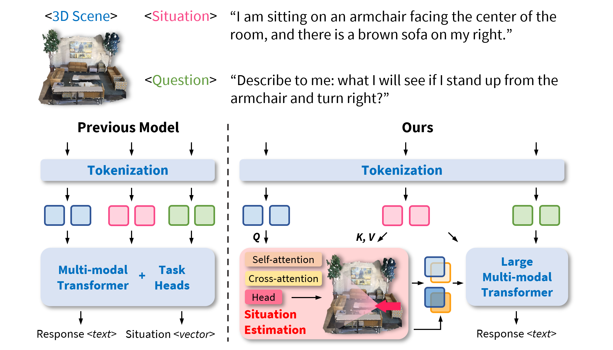

# Situational Awareness Matters in 3D Vision Language Reasoning

<a href="https://yunzeman.github.io/" style="color:blue;">Yunze Man</a> ·
<a href="https://cs.illinois.edu/about/people/department-faculty/lgui" style="color:blue;">Liang-Yan Gui</a> ·
<a href="https://yxw.web.illinois.edu/" style="color:blue;">Yu-Xiong Wang</a>

[CVPR 2024] [[`Project Page`](https://yunzeman.github.io/situation3d/)] [[`arXiv`](https://arxiv.org/abs/2406.07544)] [[`pdf`](https://yunzeman.github.io/situation3d/static/Situation3D_CVPR2024.pdf)] [[`BibTeX`](#BibTex)]

[](https://pytorch.org/) [](https://arxiv.org/) [](https://yunzeman.github.io/situation3d/) [](https://www.youtube.com/watch?v=IvjZXOs0Ozo) [](https://github.com/YunzeMan/Situation3D) [](https://opensource.org/licenses/MIT)

This repository contains the official PyTorch implementation of the paper "Situational Awareness Matters in 3D Vision Language Reasoning" (CVPR 2024). The paper is available on [Arxiv](https://arxiv.org/abs/2406.07544). The project page is online at [here](https://yunzeman.github.io/situation3d/).


## About

Previous methods perform direct 3D vision language reasoning without modeling the situation of an embodied agent in the 3D environment. Our method, SIG3D, grounds the situational description in the 3D space, and then re-encodes the visual tokens from the agent's intended perspective before vision-language fusion, resulting in a more comprehensive and generalized 3D vision language (3DVL) representation and reasoning pipeline.


## News
* `06/11/2024`: Paper is available on Arxiv. Project page is online.

## TODO
- [ ] Situation Estimation
- [ ] SQA3D-based VQA
- [ ] 3DLLM-based VQA
- [ ] Evaluation and Visualization


## BibTeX
If you use our work in your research, please cite our publication:
```bibtex
@inproceedings{man2024situation3d,
      title={Situational Awareness Matters in 3D Vision Language Reasoning},
      author={Man, Yunze and Gui, Liang-Yan and Wang, Yu-Xiong},
      booktitle={CVPR},
      year={2024} 
      }
```

## Acknowledgements
This repo is built based on the fantastic work [SQA3D](https://github.com/SilongYong/SQA3D), [ScanQA](https://github.com/ATR-DBI/ScanQA), and [3D-LLM](https://github.com/UMass-Foundation-Model/3D-LLM/tree/main). We thank the authors for their great work and open-sourcing their codebase. 
